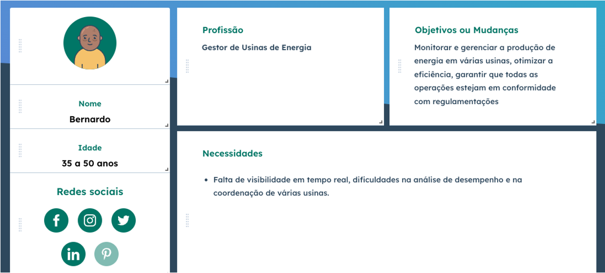
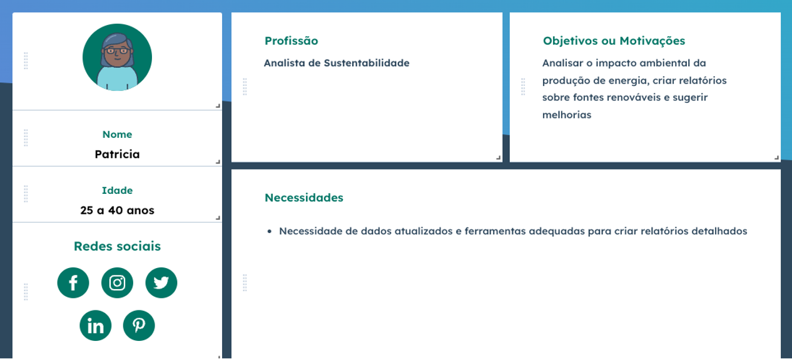
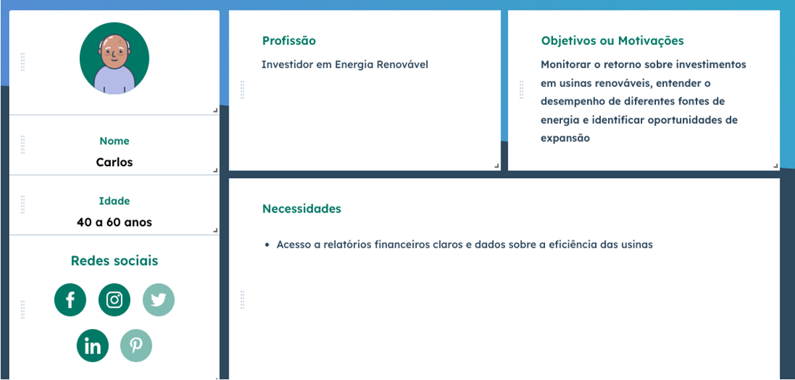
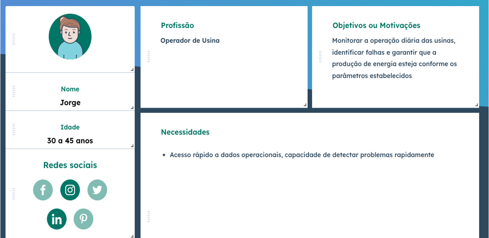
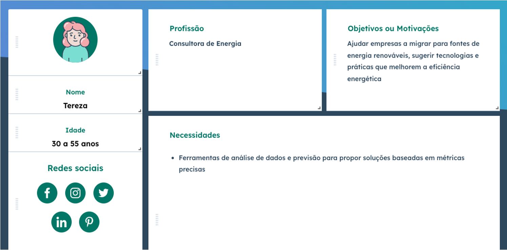

# Especificações do Projeto

Pré-requisitos: <a href="1-Documentação de Contexto.md"> Documentação de Contexto</a>

Nesta seção, será apresentada a solução e a definição detalhada do problema que a aplicação visa resolver, a partir da perspectiva dos usuários. O objetivo é garantir que o Sistema de Gerenciamento de Produção de Energia Renovável (EcoLogic) seja desenvolvido com base em necessidades reais e específicas de seus usuários, promovendo uma experiência eficiente e intuitiva.

 

## Personas

  

<h4 align="center">FIGURA 01</h4>

  

  

<h4 align="center">FIGURA 02</h4>

  

  

<h4 align="center">FIGURA 03</h4>

  

  

<h4 align="center">FIGURA 04</h4>

  

  

<h4 align="center">FIGURA 05</h4>

 

## Histórias de Usuários

Com base na análise das personas foram identificadas as seguintes histórias de usuários:

|EU COMO... `PERSONA`| QUERO/PRECISO ... `FUNCIONALIDADE` |PARA ... `MOTIVO/VALOR`                 |
|--------------------|------------------------------------|----------------------------------------|
|Bernardo (Gestor de Usinas de Energia)|Preciso monitorar em tempo real a produção de energia em várias usinas e acessar relatórios detalhados de desempenho e também quero a capacidade de comparar o desempenho entre as usinas e identificar rapidamente quaisquer desvios nos parâmetros operacionais.|Para garantir que todas as operações estejam otimizadas e em conformidade com as regulamentações.|
|Patricia (Analista de Sustentabilidade)|Preciso acessar dados atualizados sobre a produção de energia de fontes renováveis e ter acesso a ferramentas que permitam filtrar e analisar esses dados.|Para criar relatórios detalhados sobre o impacto ambiental das operações e sugerir melhorias, garantindo que a empresa esteja alinhada com suas metas de sustentabilidade.|
|Jorge (Operador de Usina)|Quero ter acesso rápido e confiável a dados operacionais diários, receber alertas em tempo real sobre qualquer anomalia e poder visualizar os dados de produção em um painel de controle intuitivo que o ajude a garantir que a produção esteja sempre dentro dos parâmetros estabelecidos.|Para monitorar as operações e identificar falhas imediatamente.|
|Carlos (Investidor em Energia Renovável)|Preciso acessar relatórios financeiros claros e dados sobre o desempenho das usinas nas quais investi e quero visualizar comparações entre diferentes fontes de energia.|Para tomar decisões mais informadas sobre futuros investimentos.|
|Tereza (Consultora de Energia)|Preciso de acesso a ferramentas que permitam a análise de dados de produção de energia e a previsão de tendências.|Para ajudar seus clientes a migrar para fontes renováveis e sugerir tecnologias e práticas que melhorem a eficiência energética.|

 

## Requisitos

As tabelas a seguir apresentam uma descrição detalhada dos requisitos funcionais e não funcionais que definem o escopo do projeto:

### Requisitos Funcionais

|ID    | Descrição do Requisito  | Prioridade |
|------|-----------------------------------------|----|
|RF-001|⁠A aplicação deve permitir que os usuários realizem login.| ALTA |
|RF-002|A aplicação deve fornecer uma página de recuperação de senha que permita o envio de um link de redefinição para o email do usuário cadastrado.| ALTA |
|RF-003|A aplicação deve disponibilizar uma página de contato que permita ao usuário enviar mensagens diretamente ao administrador, com campos para nome, empresa, localização, email, telefone e mensagem. | ALTA |
|RF-004|O administrador deve ser capaz de cadastrar novos clientes e editá-los no sistema.| ALTA | 
|RF-005|O sistema deve permitir ao administrador gerenciar informações completas sobre usinas e fontes de energia, incluindo a criação, edição, exclusão e visualização de dados de produção para cada usina.| ALTA |
|RF-006|O sistema deve gerar relatórios detalhados e gráficos sobre o desempenho energético.| ALTA |
|RF-007|O sistema deve emitir alertas e notificações em tempo real sobre acontecimentos importantes na produção, eficiência energética e outros eventos.| ALTA |
|RF-008|O sistema deve fornecer recomendações de melhorias na eficiência energética com base na análise de dados registrados e desempenho atual.| ALTA |
|RF-009|O sistema deve permitir que os clientes visualizem e exportem relatórios de produção e eficiência energética.| ALTA |

 

### Requisitos não Funcionais

|ID     | Descrição do Requisito  |Prioridade |
|-------|-------------------------|----|
|RNF-001|A aplicação deve ser compatível com os principais navegadores (Chrome, Firefox, Edge) e adaptável para diferentes dispositivos, incluindo desktops, tablets e smartphones.| ALTA | 
|RNF-002|⁠O sistema deverá ter uma usabilidade simples para maior compreensão do usuário.| ALTA | 
|RNF-003|⁠O sistema deve ser escalável para suportar o aumento de volume de dados conforme o crescimento da usina.| ALTA | 
|RNF-004|A aplicação deve seguir protocolos de segurança, garantindo a proteção dos dados coletados.| ALTA | 
|RNF-005|O sistema deverá ter um ótimo desempenho para lidar com vários usuários de uma única vez.| ALTA | 

 

## Restrições

O projeto está restrito pelos itens apresentados na tabela a seguir:

|ID| Restrição                                             |
|--|-------------------------------------------------------|
|01|O projeto deverá ser entregue até o final do semestre.|
|02|O front-end deve ser desenvolvido usando tecnologias web padrão como HTML, CSS, JavaScript e Bootstrap.|
|03|O backend deve ser implementado utilizando C#.|
|04|O banco de dados relacional (como PostgreSQL ou MySQL) deve ser utilizado para implementar no mínimo 3 CRUD's (dados das usinas, fontes e produção de energia).|
|05|O desenvolvimento do projeto deve ser realizado com o uso de ferramentas e softwares gratuitos ou com licenças acadêmicas, assegurando que todos os membros da equipe tenham acesso às tecnologias necessárias.|
|06|Todo o código deve seguir as melhores práticas de codificação e padrões estabelecidos para garantir legibilidade e manutenção.|
|07|A equipe deve colaborar em todas as etapas do projeto, assegurando que todos os membros estejam envolvidos nas decisões e no desenvolvimento das atividades de forma ativa e participativa.|
|08|O site deve seguir rigorosamente as diretrizes éticas da instituição, não permitindo a inclusão de conteúdos ofensivos, discriminatórios ou que violem códigos de conduta.|
|09|O conteúdo do site deve ser original ou proveniente de fontes de domínio público, garantindo a conformidade com as leis de direitos autorais.|
|010|A aplicação deve estar em conformidade com a Lei Geral de Proteção de Dados (LGPD) do Brasil, garantindo que os dados dos usuários e informações sensíveis estejam protegidos.|
|011|Todo o material do projeto será disponibilizado em um repositório na plataforma GitHub.|
|012|A aplicação requer uma conexão constante à internet para funcionar corretamente.|

 

## Diagrama de Casos de Uso

<h4 align="center">FIGURA 06</h4>

 

> **Ferramentas utilizadas para o desenvolvimento das Especificações do Projeto**:
> - Site: https://br.hubspot.com/make-my-persona
> - Site: https://app.diagrams.net/
